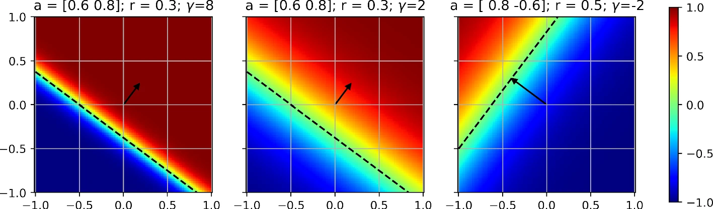
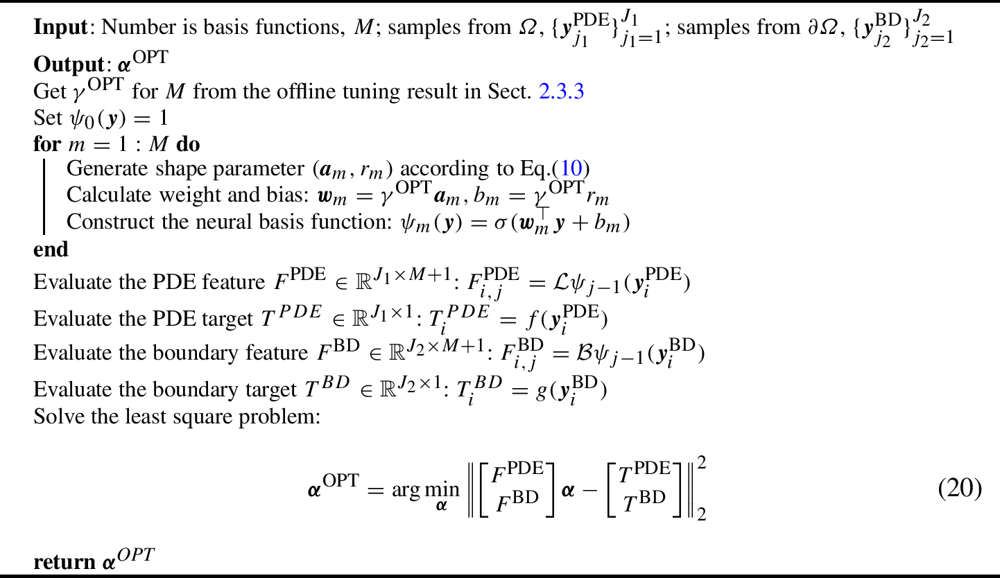

# TransNet

## 基本信息

- 标题: TransNet: Transferable Neural Networks for Partial Differential Equations
- 作者: 
  1. [Zezhong Zhang](../Authors/Zezhong_Zhang.md)
  2. [Feng Bao](../Authors/Feng_Bao.md)
  3. [Lili Ju](../Authors/Lili_Ju_鞠立力.md)
  4. [Guannan Zhang](../Authors/Guannan_Zhang.md)
- 预印: [ArXiv](https://arxiv.org/abs/2301.11701v1)
- 发表: [Springer: Journal of Scientific Computing](../Publications/Springer-JSC.md) (2024) Vol.99 No.2 | [DOI](https://doi.org/10.1007/s10915-024-02463-y) 
- 谷歌: [Scholar](https://scholar.google.com/scholar?cluster=104089547461515275)
- 时点: 
  - 2023.01.27 Preprint (v1)
  - 2023.05.06 Received
  - 2023.11.21 Revised
  - 2024.01.15 Accepted
  - 2024.02.21 Published Online
- 更新:
  - 2024.08.13

注: 对原论文章节进行了重排.

## 摘要

展开原文

> Transfer learning for partial differential equations (PDEs) is to develop a pre-trained neural network that can be used to solve a wide class of PDEs. 
> Existing transfer learning approaches require much information about the target PDEs such as its formulation and/or data of its solution for pre-training. 
> In this work, we propose to design transferable neural feature spaces for the shallow neural networks from purely function approximation perspectives without using PDE information. 
> The construction of the feature space involves the re-parameterization of the hidden neurons and uses auxiliary functions to tune the resulting feature space. 
> Theoretical analysis shows the high quality of the produced feature space, i.e., uniformly distributed neurons. 
> We use the proposed feature space as the pre-determined feature space of a random feature model, and use existing least squares solvers to obtain the weights of the output layer.
> Extensive numerical experiments verify the outstanding performance of our method, including significantly improved transferability, e.g., using the same feature space for various PDEs with different domains and boundary conditions, and the superior accuracy, e.g., several orders of magnitude smaller mean squared error than the state of the art methods. 

 

用于偏微分方程的迁移学习是指开发一个可以用于求解一大类偏微分方程的预训练神经网络.
现有的迁移学习方法需要大量关于目标偏微分方程的信息, 例如它的具体形式和/或其解的数据进行预训练.
在这项工作中, 我们提出为浅层神经网络设计可迁移的神经特征空间, 这些空间是从纯粹的函数逼近角度出发构建的, 无需偏微分方程信息.
特征空间的构造涉及到隐藏神经元的重参数化和使用辅助函数来调整生成的特征空间.
理论分析表明构造的特征空间的高质量, 即均匀分布神经元.
我们将所提出的特征空间作为随机特征模型的预定义特征空间, 并使用现有的最小二乘求解器来获得输出层的权重.

大量的数值实验验证了我们方法的优越性能, 包括两点:
1. 显著提高的可迁移性, 例如求解具有不同定义域和边界条件的各种偏微分方程时使用相同特征空间;
2. 优越的精度, 例如比现有方法的均方误差小了几个数量级.

## 1.引言

展开原文

> The rapid advancement of deep learning has attracted significant attention of researchers to explore how to use deep learning to solve scientific and engineering problems. 
> Since numerical solutions of partial differential equations (PDEs) sit at the heart of many scientific areas, there is a surge of studies on how to use neural networks to leverage data and physical knowledge to solve PDEs ([PINN [1]](PINN.md); [DRM [2]](DRM.md); [PDE-Net [3]](PDE-Net.md); [WAN [4]](WAN.md); [FNO [5]](FNO.md); [6]; [DeepONet [7]](DeepONet.md); [DeepGreen [8]](DeepGreen.md); [9]; [10]; [11]). 
> The neural network-based methods have several advantages over traditional numerical methods (e.g., finite element, finite difference, and finite volume), such as avoiding the need for numerical integration, generating differentiable solutions, exploiting advanced computing capabilities, e.g., GPUs. 
> Nevertheless, a major drawback of these deep learning methods for solving PDEs is the high computational cost associated with the neural network training/retraining using stochastic gradient descent (SGD). 
> One of the popular strategies to alleviate this issue is transfer learning.
>
> Transfer learning for PDEs is to develop a pre-trained neural network that can be effectively re-used to solve a PDE with multiple coefficients or in various domains, or to solve multiple types of PDEs. 
> When transferring a pre-trained neural network from one scenario to another, the feature space, e.g., the hidden layers, is often frozen or slightly perturbed, which can dramatically reduce the training overhead by orders of magnitude. 
> However, existing transfer learning approaches for PDEs, (e.g., [FNO [5]](FNO.md); [DeepONet [7]](DeepONet.md); [12]; [13]) require information/knowledge of the target family of PDEs to pre-train a neural network model. 
> The needed information could be the analytical definitions of the PDEs including initial and boundary conditions, and/or measurement data of the PDE's solution. 
> These requirements not only lead to time-consuming simulation data generation using other PDE solvers, but also limits the transferability of the pre-trained neural network (i.e., the pre-trained network is only transferable to the same or similar type of PDEs that are used for pre-training).
>
> To overcome the above challenges, in this paper, we propose a ***Transferable Neural Network (TransNet)*** to improve the transferability of neural networks for solving PDEs. 
> The key idea is to construct a pre-trained neural feature space without using any PDE information so that the pre-trained feature space could be transferred to a variety of PDEs with different domains and boundary conditions. 
> We limit our attention to the so-called shallow neural networks, which have only one hidden layer between the input and output layers. 
> Such single-hidden-layer fully-connected neural networks have sufficient expressive power for low-dimensional PDEs that are commonly used in science and engineering fields ([14]; [15]; [16]; [17]). 
> Specifically, we treat each hidden neuron as a basis function and re-parameterize all the neurons to separate the parameters that determine the neuron's location and the ones that control the shape (i.e., the slope) of the activation function. 
> Then, we develop a simple, yet very effective, approach to generate uniformly distributed neurons in the unit ball, and rigorously prove the uniform neuron distribution. 
> Then, the shape parameters of the neurons are tuned using auxiliary functions, i.e., realizations of a Gaussian process. 
> The entire feature space construction (determining the hidden neurons' parameters) does not require the PDE's formulation or data of the PDE's solution. 
> When applying the constructed feature space to a PDE problem, we use the proposed feature space as the pre-determined feature space of a random feature model [18]; [19] [20], and use existing least squares solvers to solve for the parameters of the output layer by minimizing the standard PDE residual loss. 
> This can be done by either solving a simple least squares problem for linear PDE or combining a least squares solver with a nonlinear iterative solver, e.g., Pichard iteration, for nonlinear PDEs.
> The major contributions are summarized as
> - We develop transferable neural feature spaces for the shallow neural networks that are independent of any PDE, and can be applied to effectively solve various linear and nonlinear PDE problems.
> - We theoretically and computationally prove the uniform distribution of the hidden neurons, viewed as global non-orthogonal basis functions, for the proposed ***TransNet*** in the unit ball of any dimension.
> - We demonstrate the superior accuracy and efficiency of the proposed ***TransNet*** for solving PDEs, e.g., the mean square errors of ***TransNet*** are several orders of magnitudes smaller than those by the state-of-the-art methods.
>
> The rest of the paper is organized as follows. 
> In [Section.2](#related_work) we briefly review some related work. 
> In [Section.3](#methodology), we first discuss the transferable neural feature space and the uniformly distributed neurons and then present the ***TransNet*** and its application to solving general linear and nonlinear PDEs. 
> Various numerical tests and comparisons are carried out in [Section.4](#experiments) to demonstrate the superior performance of the proposed ***TransNet***. 
> Finally, some concluding remarks are given in [Section.5](#conclusion).

 

## 2.相关工作

展开原文

> Studies on using neural networks for solving PDEs can be traced back to some early works, e.g., [21]; [22]. 
> Recent advances mostly have been focused on physics-informed neural networks (PINN). 
> The general idea of PINN is to represent the PDE's solution by a neural network, and then train the network by minimizing the residual function of the PDE at a set of samples in the domain of computation. 
> Several improvements on the training and sampling were proposed in [DeepXDE [23]](DeepXDE.md); [24]; [25]; [26]. 
> Besides directly minimizing the PDE's residual, there are studies on how to combine traditional PDE solvers with neural networks. 
> For example, the [deep Ritz method [2]](DRM.md) uses the variational form of PDEs and combines the SGD with numerical integration to train the network; the [deep Galerkin method [27]](DGM.md) combines the Galerkin method with machine learning; the [PDE-Net [3]](PDE-Net.md) uses a stack of neural networks to approximate the PDE solutions over a multiple of time steps, which was further combined with a symbolic multilayer neural network for recovering PDE models in [PDE-Net 2.0 [28]](PDE-Net2.0.md).
>
> Another type of deep learning method for PDEs is to use neural networks to learn a family of PDE operators, instead of a single equation. 
> The [Fourier neural operator (FNO) [5]](FNO.md) parameterizes the integral kernel in Fourier space and is generalizable to different spatial/time resolutions. 
> The [DeepONet [7]](DeepONet.md) extends the universal approximation theorem [29] to deep neural networks, and its variant [30] further reduces the amount of data needed for training.
> The [physics-informed neural operator (PINO) [31]](PINO.md) combines operator learning with function approximation to achieve higher accuracy. 
> [MIONet [32]](MIONet.md) was proposed to learn multiple-input operators via tensor product based on low-rank approximation.
>
> Random feature models together with shallow neural networks have also been used to solve PDEs ([18]; [19]; [20]) or learn PDE operators [33]. 
> The theory of random feature models for function approximation was developed due to its natural connection with kernel methods ([34]; [35]). 
> The proposed ***TransNet*** can be viewed as an improved random feature model for PDEs from two perspectives: (1) the re-parameterization of the weight and bias parameters of the hidden neurons into two separate parameters that determine the location and shape of each neuron respectively, (2) the usage of auxiliary functions to tune the neural feature space, which makes a critical contribution to the improvement of the accuracy of ***TransNet*** in solving PDEs.

 

## 3.方法论

### 3.1.问题设置与背景

展开原文

> We introduce the problem setup for using neural networks to solve partial differential equations. 
> The PDE of interest can be presented in a general formulation, i.e.,

$$
\left\{
\begin{aligned}
  & \mathcal{L}(u(\bm y)) = f(\bm y)\;\;  \text{ for }\; \bm y \in \Omega,\\
  & \mathcal{B}(u(\bm y)) =  g(\bm y)\;\;  \text{ for }\; \bm y \in \partial \Omega,
\end{aligned}
\right.\tag{01}
$$

> where $\Omega \subset \mathbb{R}^{d}$ with the boundary $\partial \Omega$ is the spatial-temporal bounded domain under consideration, $\bm y := (\bm x, t) = (x_1, \ldots, x_{d-1}, t)^{\mathsf{T}}\in \mathbb{R}^d$ is a column vector includes both spatial and temporal variables, $u$ denotes the unknown solution of the PDE, $\mathcal{L}(\cdot)$ is a differential operator, $\mathcal{B}(\cdot)$ is the operator defining the initial and/or boundary conditions, $ f(\bm y)$ and $g(\bm y)$ are the right hand sides associated with the operators $\mathcal{L}(\cdot)$ and $\mathcal{B}(\cdot)$, respectively. 
> For notational simplicity, we assume that the solution is a scalar function; the proposed method can be extended to vector-valued functions without any essential difficulty. 

> Let us consider a single-hidden-layer fully-connected neural networks, denoted by
>
> $$
>   u_{\rm NN}(\bm y) := \sum_{m = 1}^M \alpha_m\, \sigma( \bm w_m^{\mathsf{T}} \bm y + b_m) + \alpha_0,\tag{02}
> $$
>
> where $M$ is the number of hidden neurons, the vector $\bm w_m = (w_{m,1}, \cdots, w_{m,d})^{\mathsf{T}}$ and the scalar $b_m$ are the weights and bias of the $m$-th hidden neuron, the vector $\bm \alpha = (\alpha_0,\alpha_1,\cdots,\alpha_M)^{\mathsf{T}}$ includes the weights and bias of the output layer, and $\sigma(\cdot)$ is the activation function. 
> As demonstrated in Section.4, this type of neural network have sufficient expressive power for solving a variety of PDEs with satisfactory accuracy.

> [A typical method [36]](PIML.md) for solving the PDE in Eq.01 is to directly parameterize the solution $u(\bm y)$ as a neural network $u_{\rm NN}(\bm y)$ in Eq.02 and optimize the neural network's parameters by minimizing the PDE residual loss, e.g., $L(\bm y) = \|\mathcal{L}(u(\bm y)) - \mathcal{L}(u_{\rm NN}(\bm y))\|_2 + \|\mathcal{B}(u(\bm y)) - \mathcal{B}(u_{\rm NN}(\bm y)) \|_2$, at a set of spatial-temporal locations. 
> Despite the good performance of these approaches in solving PDE problems, its main drawback is the **limited transferability** because of the high computational cost of gradient-based re-training and hyperparameter re-tuning. 
> When there is any change to the operators $\mathcal{L}(\cdot), \mathcal{B}(\cdot)$, the right-hand-side functions $f(\bm y), g(\bm y)$, or the shape of the domain $\Omega$, the neural network $u_{\rm NN}(\bm y)$ often needs to be re-trained using gradient-based optimization (even though the current parameter values could provide a good initial guess for the re-training), or the hyperparameters associated with the network and the optimizer need to be re-tuned. 
> In comparison, the random feature models require much lower re-training costs, which has been exploited in learning operators [33](Random-Features-Banach.md) and dynamical systems [19](Random-Feature-Interacting-System.md); [37](Deep-LFM.md).

 

首先介绍使用神经网络求解偏微分方程的问题设置.
需要求解的偏微分方程通常可以表示为如下的一般形式:

$$
\left\{
\begin{aligned}
  & \mathcal{L}(u(\bm y)) = f(\bm y)\;\;  \text{ for }\; \bm y \in \Omega,\\
  & \mathcal{B}(u(\bm y)) =  g(\bm y)\;\;  \text{ for }\; \bm y \in \partial \Omega,
\end{aligned}
\right.\tag{01}
$$

其中:
- $\Omega \subset \mathbb{R}^{d}$ 是时空间有界定义域;
- $\partial \Omega$ 是定义域的边界;
- $\bm y := (\bm x, t) = (x_1, \ldots, x_{d-1}, t)^{\mathsf{T}}\in \mathbb{R}^d$ 是包含空间和时间变量的列向量;
- $u$ 是偏微分方程的未知解;
- $\mathcal{L}(\cdot)$ 是微分算子;
- $\mathcal{B}(\cdot)$ 是定义初始条件和/或边界条件的算子;
- $f(\bm y)$ 是与 $\mathcal{L}(\cdot)$ 相关的右端项.
- $g(\bm y)$ 是与 $\mathcal{B}(\cdot)$ 相关的右端项.

为了便于记号, 我们假设偏微分方程的解是一个标量函数.
所提出的方法可以扩展到矢量值函数, 并无额外的难点.

---

让我们考虑一个单隐层的全连接神经网络, 其形式为:

$$
  u_{\rm NN}(\bm y) := \sum_{m = 1}^M \alpha_m\, \sigma( \bm w_m^{\mathsf{T}} \bm y + b_m) + \alpha_0,\tag{02}
$$

其中:
- $M$ 是隐层神经元的数量;
- $\bm w_m = (w_{m,1}, \cdots, w_{m,d})^{\mathsf{T}}$ 是第 $m$ 个隐层神经元的权重向量;
- $b_m$ 是第 $m$ 个隐层神经元的偏置;
- $\bm \alpha = (\alpha_0,\alpha_1,\cdots,\alpha_M)^{\mathsf{T}}$ 是输出层的权重向量;
- $\sigma(\cdot)$ 是激活函数.

如[实验一节](#experiments)所述, 这类神经网络具有足够的表达能力, 能够求解各种偏微分方程, 取得可观的精度.

---

[Physics-Informed Machine Learning (PIML) [36]](PIML.md) 中指出求解上述偏微分方程的一种典型方法是直接将解 $u(\bm y)$ 参数化为形如上述的神经网络 $u_{\rm NN}(\bm y)$, 并通过最小化在时空样本点集上的偏微分方程残差损失 $L(\bm y) = \|\mathcal{L}(u(\bm y)) - \mathcal{L}(u_{\rm NN}(\bm y))\|_2 + \|\mathcal{B}(u(\bm y)) - \mathcal{B}(u_{\rm NN}(\bm y)) \|_2$ 来优化神经网络的参数.

尽管这些方法在求解偏微分方程问题上有不错的性能, 但其主要的缺点是**有限的可迁移性**, 这是因为这类方法遇到新的问题时需要采用基于梯度的重新训练和超参数重新调整, 这使得其计算代价高昂.
当对算子, 右端项函数或定义域形状有任何修改时, 神经网络 $u_{\rm NN}(\bm y)$ 通常需要通过基于梯度的优化方法重新训练 (即便当前参数值能够为重新训练提供一个良好的初始值), 或者对网络和优化器相关的超参数进行重新调整.

相比之下, 随机特征模型的重新训练成本要低得多. 此前这种方法已经被应用于学习算子 ([The Random Feature Model for Input-Output Maps between Banach Spaces [33]](Random-Features-Banach.md)) 和动态系统 ([Random Feature Models for Learning Interacting Dynamical Systems [19]](Random-Feature-Interacting-System.md);  [Deep Latent Force Models [37]](Deep-LFM.md)) 中.

### 3.2.神经特征空间 

展开原文

> **The Neural Feature Space**
>
> We can treat each hidden neuron $\sigma(\bm w_m^{\mathsf{T}} \bm y + b_m)$ as a nonlinear feature map from the space of $\bm y \in \mathbb{R}^{d}$ to the output space $\mathbb{R}$. 
> From the perspective of approximation theory, the set of hidden neurons $\{\sigma(\bm w_m^{\mathsf{T}} \bm y + b_m)\}_{m=1}^M$ can be viewed as a globally supported basis in $\mathbb{R}^d$. 
> The **neural feature space**, denoted by $\mathcal{P}_{\rm NN}$, can be defined by the linear space expanded by the basis $\{\sigma(\bm w_m^{\mathsf{T}} \bm y + b_m)\}_{m=1}^M$, i.e., 
>
> $$
>  \mathcal{P}_{\rm NN} = {span}\Big\{1, \sigma(\bm w_1^{\mathsf{T}} \bm y + b_1), \ldots, \sigma(\bm w_M^{\mathsf{T}} \bm y + b_M) \Big\},\tag{03}
> $$
>
> where the constant basis corresponds to the bias of the output layer. 
> Then, the neural network in Eq.02 lives in the linear space, i.e., $u_{\rm NN}(\bm y) \in \mathcal{P}_{\rm NN}.$
> In other words, the neural network approximation can be viewed as a spectral method with **non-orthogonal** basis, and the parameters $\bm \alpha$ in Eq.02 of the output layer of $u_{\rm NN}(\bm y)$ is the coefficients of the expansion in the neural feature space $\mathcal{P}_{\rm NN}$. 
>
> In the PINN methods, the neural feature space $\mathcal{P}_{\rm NN}$ and the coefficient $\bm \alpha$ are trained simultaneously using SGD methods, which often leads to a non-convex and ill-conditioned optimization problem. 
> It has been shown that the non-convexity and ill-conditioning in the neural network training are major reasons of unsatisfactory accuracy of the trained neural network. 
> A natural idea to reduce the complexity of the training is to decouple the training of $\mathcal{P}_{\rm NN}$ from that of $\bm \alpha$. 
> For example, in random feature models, $\mathcal{P}_{\rm NN}$ is defined by randomly generating the parameters $\{(\bm w_m, b_m)\}_{m=1}^M$ from a user-defined probability distribution; the coefficients $\bm \alpha$ can then be obtained by solving a linear system when the operators $\mathcal{L}$, $\mathcal{B}$ in Eq.01 are linear. 
> However, the numerical experiments in Section.4 show that the random feature model based on Eq.02 converges very slowly with the increase of the number of features. 
> This drawback motivates us to develop a methodology to customize the neural feature space $\mathcal{P}_{\rm NN}$ to improve the accuracy, efficiency and transferability of $u_{\rm NN}$ in solving PDEs. 

 

### 3.3.构造可迁移神经特征空间 

展开原文

> **Constructing Transferable Neural Feature Spaces**
> This section contains the key ingredients of the proposed ***TransNet***. 
> The goal is to construct a single neural feature space $\mathcal{P}_{\rm NN}$ that can be used to solve various PDEs in different domains. 

 

这一节包含了本文提出的 ***TransNet*** 的关键组成部分.
目标是构造单个神经特征空间 $\mathcal{P}_{\rm NN}$, 可以用于解决不同定义域的各种偏微分方程.

#### 3.3.1.对 $\mathcal{P}_{\rm NN}$ 重参数化 

展开原文

> **Re-Parameterization of $\mathcal{P}_{\rm NN}$**
>
> The first step is to re-parameterize the weight and bias of each hidden neuron $\sigma(\bm w_m^{\mathsf{T}} \bm y + b_m)$, into distinct parameters that determine the location and shape of the neuron.
> Each hidden neuron is viewed as a globally supported basis function $\psi_{m}(\bm y)$ in $\Omega$, i.e., $\psi_{m}(\bm y)=\sigma(\bm w_m^{\mathsf{T}} \bm y + b_m)$.
> If we rewrite the hidden neuron as
> $$
>   \sigma(\bm w_m^{\mathsf{T}} \bm y + b_m)=\sigma(\gamma_m(\bm a_m^{\mathsf{T}} \bm y + r_m)),\tag{04}
> $$
>
> where $\|\bm a_m\|_2 = 1$ and $\gamma_m\geq 0$, we obtain the re-parameterization of $(\bm w_m, b_m)$ into the location parameter $(\bm a_m, r_m)$ and shape parameter $\gamma_m$. 
> Their equivalence is given by
> $$
>   \begin{cases}
>     \bm w_m = \gamma_m \bm a_m \\
>     b_m = \gamma_m r_m
>   \end{cases} \Leftrightarrow
>   \begin{cases}
>     \bm a_m = \dfrac{\bm w_m}{\|\bm w_m\|_2} \\
>     r_m = \dfrac{b_m}{\|\bm w_m\|_2} \\
>     \gamma_m = \|\bm w_m\|_2
>   \end{cases}\tag{05}
> $$
>
> After the re-parameterization, each parameter now holds a distinct geometric interpretation towards the basis function $\psi_{m}(\bm y)$. 
>
> When the activation $\sigma$ is the ReLU function, there is an important concept called **partition hyperplane** which separates the activated region and unactivated region and is defined by 
>
> $$
>  \bm w_m^{\mathsf{T}} \bm y + b_m = 0\tag{06}.
> $$
>
> This partition hyperplane can be exactly recovered by the location parameter as
> $$
>   \bm a_m^{\mathsf{T}}\bm y + r_m = 0\tag{07}.
> $$
>
> The geometric significance of the partition hyperplane is also crucial for other activation functions, such as $tanh(\cdot)$, which is widely employed in solving PDEs due to its smoothness, including in this work. 
> We will now discuss the geometric interpretation of the shape and location parameter with $tanh(\cdot)$ as the activation function. 
> The partition hyperplane in Eq.07 describes the transition plane from -1 to 1. 
> More specifically, the unit vector $\bm a_m$ represents the normal direction of the partition hyperplane, while $|r_m|$ indicates its distance from the origin.
> The shape parameter $\gamma_m$ governs the steepness of the pre-activation value $\bm w_m^{\mathsf{T}}\bm y + b_m$ along the normal direction $\bm a_m$, which translates to the transition rate from -1 to 1 on basis $\psi_m(\bm y)$. 
> This can also be geometrically interpreted as the width of the transition band (see [Figure.01](#figure.01)). 
>
> Figure.01 shows three 2D basis functions with different shape and location parameters, where the black dashed lines represent the partition hyperplanes and the black arrows denote the normal direction $\bm a_m$ scaled by $|r_m|\text{sign}(\gamma_m)$, i.e., $\bm a_m|r_m|\text{sign}(\gamma_m)$. 
> The arrow marks the direction of increase in $\psi_m(\bm y)$, and its length equals the distance from the origin to the hyperplane. 
> It is evident that the value of the basis functions changes at the partition hyperplane along the normal direction, while its value remains constant orthogonal to the normal direction. 
> For a larger $\gamma$, the transition band is narrower compared to a small $\gamma$.
> Comparing different basis functions (from the middle to the left and middle to the right), it becomes evident that changing the location parameter solely affects the location of the basis function but not its shape, and vice versa. 
> Thus, the re-parameterization in Eq.04 effectively segregates location and shape parameters, each possessing almost independent geometric significance, making it natural to handle them differently.

 

图 01. 对方程 04 中定义的具有不同位置和形状参数的神经基函数 $\psi_m(\bm y)$ 的可视化.
黑色虚线表示划分超平面, 黑色箭头 $\bm a_m |r_m|\text{sign}(\gamma_m)$ 是对法方向 $\bm a_m$ 进行缩放 $|r_m|\text{sign}(\gamma_m)$ 倍.

#### 3.3.2.为 $\mathcal{P}_{\rm NN}$ 生成均匀分布的神经元 

展开原文

> **Generating Uniformly Distributed Neurons for $\mathcal{P}_{\rm NN}$**
>
> The second step for constructing $\mathcal{P}_{\rm NN}$ is to determine the location parameters $\{(\bm a_m,r_m)\}^{M}_{m=1}$ in Eq.04. 
> As illustrated in [Figure.01](#figure.01), it is evident that the location parameter exerts its influence on the basis function through the position of the partition hyperplane. 
> And our approach is to generate a set of random $\{(\bm a_m,r_m)\}^{M}_{m=1}$, to ensure the creation of uniformly distributed partition hyperplanes within $\Omega$.
>
> The idea for handling the location parameters for $\psi_m(\bm y)$ through the partition hyperplane is inspired by studies on the activation patterns of ReLU networks. 
> A ReLU network is essentially a piecewise-linear function in the input domain, where the boundary of each linear piece is determined by the partition hyperplanes. 
> For a ReLU network to exhibit good expressive power, it is believed that having more linear pieces within the computational domain is desirable. 
> Studies ([38]; [39]) have shown that the number of linear pieces is directly related to the class of functions that can be well approximated by the ReLU network, i.e., the expressive power. 
> This correlation also gives rise to a line of research ([38]; [40]; [41]; [42]; [43]) that focus on estimating the number of linear pieces in the ReLU networks. Intuitively, relating the expressive power of the ReLU network to the number of linear pieces is also understandable, as a ReLU network with only one linear piece reduces to a simple linear map.
> 
> In addition to the number of linear pieces, the distribution of linear pieces also plays a crucial role. A denser distribution of linear pieces in a specific region of the domain may enhance approximation quality for that region. However, to ensure good transferability, which means the feature space is effective for a wide range of PDEs with different domain shapes,our goal is to establish uniformly distributed linear pieces throughout the domain. This guarantees equal expressive power across all parts of the domain. Intuitively, the density of the linear pieces can be defined as the number of linear pieces in a given region divided by its volume. 
> Alternatively, it can also be indirectly measured by the boundary volume in that given region [44]. Building upon this concept, in this work, we propose using the density of the partition hyperplane to quantify the local expressive power.
>
> In this subsection, we assume $\Omega$ is a unit ball, i.e., $B_1(\bm 0) = \{y : \|y\|_2\leq 1\} \subset \mathbb{R}^d$. 
> For an arbitrary point $y\in\Omega$, we denote the partition hyperplane density as $D_M^{\tau}(\bm y)$, where the $M$ is the number of partition hyperplanes and $\tau > 0$ is the bandwidth for calculating the density.
> To proceed, we first measure the distance from $\bm y$ to each partition hyperplane defined in Eq.07 by
> $$
> d_m(\bm y) = \frac{\|\bm a_m^{\mathsf{T}}\bm y + r_m\|_2}{\|\bm a_m\|_2} = |\bm a_m^{\mathsf{T}}\bm y + r_m |, \quad m=1,\cdots,M.\tag{08}
> $$
>
> Based on the above point-to-plane distance, we then define the partition hyperplane density $D_M^{\tau}(\bm y)$ as
> $$
> D_m^{\tau}(\bm y) = \dfrac{1}{M}\sum_{m=1}^{M} \bm 1_{\{d_m(\bm y)< \tau\}}(\bm y),\tag{09}
> $$
> 
> where $\bm 1_{\{d_m(\bm y)< \tau\}}(\bm y)$ is the indicator function of whether the distance between $\bm y$ and the $m$-th partition hyperplane is smaller than $\tau$. 
> Intuitively, $D_M^{\tau}(\bm y)$ measures the percentage of neurons whose partition hyperplane intersects the ball with center $\bm y$ and radius $\tau$, $B_{\tau}(\bm y)$.
> The uniformity of the partition hyperplane can be formally measured by how much $D_M(\bm y)$ varies in $\Omega$.
>
> Next, we outline the sampling process for the random location parameters $\{(\bm a_m,r_m)\}^{M}_{m=1}$ that yield a constant hyperplane density $D_M^{\tau}(\bm y)$ in $\Omega$ under expectation. 
> Specifically, we start by generating the normal directions $\{\bm a_m\}^M_{m=1}$ uniformly distributed on the $d$-dimensional unit sphere. 
> It's important to note that when $d > 2$, sampling uniformly in the angular space in the hyperspherical coordinate system doesn't result in uniformly distributed samples on the unit sphere. 
> This challenge is known as the sphere point picking problem. 
> To address this, we draw samples from the d-dimensional standard Gaussian distribution in the Cartesian coordinate system and normalize the samples to unit vectors to obtain $\{\bm a_m\}^M_{m=1}$. 
> Then, $\{r_m\}^{M}_{m=1}$ is generated from a uniform distribution on $[0, 1]$. 
> The complete sampling procedure is expressed as follows:
> $$
> \bm a_m = \dfrac{X_m}{\| X_m \|_2},\quad r_m = U_m,\quad m=1,\cdots,M,\tag{10}
> $$
>
> where $X_m$ are i.i.d. standard Gaussian distribution and $U_m$ follows i.i.d. uniform distribution on $[0, 1]$. 
> The subsequent theorem demonstrates that our approach yields a set of uniformly distributed partition hyperplanes in $\Omega$, measured by a constant expected density $\mathbb{E}[D_M^{\tau}(\bm y)]$ in $\Omega$.

 

##### 定理一 (均匀神经元分布)

展开原文

> **Theorem 1 (Uniform Neuron Distribution)**
> Given the partition hyperplane defined as follow (Eq.07), 
> $$
> \bm a_m^{\mathsf{T}}\bm y + r_m = 0
> $$
> if $\{\bm a_m\}^M_{m=1}$ are i.i.d. and uniformly distributed on the $d$-dimensional unit sphere, i.e., $\| \bm a_m \|_2 = 1$, and $\{r_m\}^M_{m=1}$ are i.i.d. and uniformly distributed in $[0, 1]$, then, for a fixed $\tau\in (0, 1)$,
> $$
>  \mathbb{E}[D_M^{\tau}(\bm y)] = \tau,\quad  \forall \| \bm y \|_2 \leq  1 − \tau,
> $$
> 
> where $D_m^{\tau}(\bm y)$ is the density function defined as follow (Eq.09).
>
> $$
>  D_m^{\tau}(\bm y) = \dfrac{1}{M}\sum_{m=1}^{M} \bm 1_{\{d_m(\bm y)< \tau\}}(\bm y)
> $$
>
> ---
> **Proof**
>
> For a fixed $\bm y\in\Omega$, we can write the expectation of $D_M^{\tau}(\bm y)$ as
> $$
> \begin{aligned}
> \mathbb{E}[D_M^{\tau}(\bm y)] &= \mathbb{E}[\dfrac{1}{M}\sum_{m=1}^{M} \bm 1_{\{d_m(\bm y)< \tau\}}(\bm y)] \\
>  &=\dfrac{1}{M}\sum_{m=1}^{M} \mathbb{E}[\bm 1_{\{d_m(\bm y)< \tau\}}(\bm y)] \\
> \end{aligned}\tag{11~12}
> $$
>
> Use the i.i.d property of $\{\bm a_m\}_{m=1}^M$ and $\{r_m\}_{m=1}^M$, we have
> $$
> \mathbb{E}[\bm 1_{\{d_m(\bm y)< \tau\}}(\bm y)] = \mathbb{E}[\bm 1_{\{d_{m'}(\bm y)< \tau\}}(\bm y)],\quad \forall 1\leq m, m' \leq M.\tag{13}
> $$
>
> Therefore, we can simplify the notation by dropping the subscript $m$ from $(\bm a_m, r_m)$ and $\bm 1_{\{d_m(\bm y)< \tau\}}(\bm y)$, and use $(\bm a, r)$ and $\bm 1_{\{d(\bm y)< \tau\}}(\bm y)$ to denote them in the following derivation.
>
> The expected density can now be written as
> $$
> \begin{aligned}
> \mathbb{E}[D_M^{\tau}(\bm y)] &= \mathbb{E}[\bm 1_{\{d(\bm y)< \tau\}}(\bm y)] \\
> &= \mathbb{E}[\bm 1_{\{|\bm a^{\mathsf{T}}\bm y+r|< \tau\}}(\bm y)] \\
> &= \mathbb{P}[|\bm a^{\mathsf{T}}\bm y + r|<\tau] 
> \end{aligned}\tag{14}
> $$
>
> Given the independence between $\bm a$ and $r$, and the fact that the distribution of $r$ is known, we are only left with the unknown distribution of $\bm a^{\mathsf{T}} \bm y$.
> By our assumption, $\bm a$ is uniformly distributed on a $d$-dimensional unit sphere, and $\bm y$ is a constant vector.
>
> To proceed, we begin by considering a unitary matrix $Q$, such as $Q\bm y = (\| \bm y\|_2,0,\cdots,0)^{\mathsf{T}}$ and define $\tilde{\bm y} = Q\bm y$ and $\tilde{a} = Q\bm a$.
> And we can write the inner product as follows:
> $$
> \bm a^{\mathsf{T}}\bm y = \bm a^{\mathsf{T}} (Q^{\mathsf{T}}Q)\bm y=(Q\bm a)^{\mathsf{T}}(Q\bm y) = \tilde{\bm a}^{\mathsf{T}}\tilde{\bm y} = \tilde{a}_1 \| \bm y\|_2
> $$
>
> where $\tilde{a}_1$ is the first component of $\tilde{\bm a}$.
> Now we only need to find the distribution of $\tilde{a}_1$.
>
> Given that $Q$ is a unitary (rotation) matrix and $\bm a$ is uniform on the $d$-dimensional unit sphere, $\tilde{\bm a}$ will also follow the same distribution as $\bm a$.
> By the construction of $\bm a$ in Eq.10, we know $\tilde{\bm a}$ can also be written in the same form as:
> $$
> \tilde{\bm a} =\dfrac{X}{\| X\|_2}
> $$
>
> where $X = (X_1,\cdots,X_d)$^{\mathsf{T}} is $d$-dimensional standard Gaussian.
> The density of $\tilde{a}_1 = \dfrac{X_1}{\| X\|_2}$ can be obtained from Eq.(1.26) in [45], as the marginal density for the normalized Gaussian:
> $$
> p_{\tilde{a}_1}(z) = \dfrac{\Gamma(\dfrac{d}{2})}{\Gamma(\dfrac{d-1}{2})\pi^{\frac{1}{2}}}(1-z^2)^{\dfrac{d-3}{2}},\quad z\in [-1,1].\tag{15}
> $$
>
> The only property we need for the proof is the symmetry of $p_{\tilde{a}_1}(z)$, i.e., $p_{\tilde{a}_1}(z) = p_{\tilde{a}_1}(-z)$.$
>
> Next we derive the analytical form of the probability $\mathbb{P}[|\bm a^{\mathsf{T}}\bm y + r|<\tau]$.
> With the probability density function $p_{\tilde{a}_1}(z)$, we can write the probability as the following integral
> $$
> \begin{aligned}
> \mathbb{P}[|\bm a^{\mathsf{T}}\bm y + r|<\tau]
> &= \mathbb{P}[|\tilde{a}_1 \| \bm y \|_2 + r| <\tau]\\
> &= \int_{\{s<-z \|\bm y\|_2+\tau\}\cup \{s>-z\| \bm y \|_2 -\tau\}} p_{\tilde{a}_1}(z) p_r(s)\text{d}z\text{d}s\\
> &= \int_{\{-z\| \bm y\|_2 - \tau < s < -z\| \bm y\|_2 + \tau\}} p_{\tilde{a}_1}(z)\text{d}z\text{d}s.
> \end{aligned}
> $$
>
> Here the support for $z$ and $s$ are $[-1,1]$ and $[0,1]$ respectively.
> Assume that $\| \bm y\|_2 \leq 1-\tau$, then the above integral can be exactly calculated by the following two cases.
>
> **Cases 1: $\| \bm y\|_2<\tau$**. 
> In this case, the integration domain is prescribed by four lines: $s=-z\| \bm y\|_2+\tau$, $s=0$, $z=-1$, and $z=1$.
> Using the symmetry property $p_{\tilde{a}_1}(z)$, we can reorganize the integration domain as a rectangular area defined by: $s=0$, $s=\tau$, $z=-1$, $z=1$.
> The integral is calculated as 
> $$
> \begin{aligned}
> \mathbb{P}[|\bm a^{\mathsf{T}}\bm y + r|<\tau]
> &= \int_{-1}^{1}\int_{0}^{\tau} p_{\tilde{a}_1}(z)\text{d}s\text{d}z\\
> &= \int_{-1}^{1}\tau p_{\tilde{a}_1}(z) \text{d}z\\
> &= \tau
> \end{aligned}
> $$
>
> **Case 2: $\tau \leq \| \bm y\|_2 \leq 1-\tau$**.
> In this case, the integration domain is defined by four lines: $s=-z \| \bm y\|_2+\tau$, $s=-z\| \bm y\|_2 - \tau$, and $s=0$, $z=-1$.
> Once again, utilizing the symmetry property $p_{\tilde{a}_1}(z)$, we can redefine the integration domain as bounded by: $s=-z\| \bm y\|_2+\tau$, $s=-z\| \bm y\|_2 - \tau$, $z=0$ and $z=-1$. 
> The integral is calculated as 
> 
> $$
> \begin{aligned}
> \mathbb{P}[|\bm a^{\mathsf{T}}\bm y + r|<\tau]
> &= \int_{-1}^{0}\int_{-z\| \bm y\|_2 - tau}^{-z\| \bm y\|_2 + tau} p_{\tilde{a}_1}(z)\text{d}s\text{d}z\\
> &= \int_{-1}^{0} (2\tau) p_{\tilde{a}_1}(z) \text{d}z\\
> &= (2\tau)\dfrac{1}{2} = \tau.
> \end{aligned}
> $$
>
> Combining case 1 and case 2, we have
> $$
> \mathbb{P} [|\bm a^{\mathsf{T}}\bm y + r|<\tau] = \tau\quad \text{for any} \| \bm y\|_2 \leq 1-\tau.
> $$
>
> Substituting this into the expected density (Eq.14) concludes the proof.
> Q.E.D.

 

---

图 02.
- 左上角: TransNet 生成的 200 个划分超平面;
- 右上角: TransNet 的划分超平面密度;
- 左下角: 高斯随机特征模型生成的 200 个划分超平面;
- 右下角: 高斯随机特征模型的划分超平面密度.

在高斯随机特征模型中, $\bm w_m$ and $b_m$ 直接从独立同分布的标准高斯分布直接生成, 且所有划分超平面密度值 $D_{M}^{\tau}(\bm y)$ 直接由蒙特卡洛模拟 ($M=50,000, \tau=0.1$) 估计得到.

展开原文

> An illustration of the density function and the partition hyperplane is provided in [Figure.02](#figure.02). 
> It is evident that the cutting hyperplane density DM(y) for our method remains constant inside the ball B1−τ(0), matching the value prescribed by our theorem with τ = 0.1. The density of the Gaussian random feature is not uniform and predominantly centered at the origin. To our surprise, the highest density value in the Gaussian random feature is even smaller than the constant density value from our method. We believe this comes from the fact that some partition hyperplanes are entirely outside of the unit ball, providing no contribution to the expressive power inside the unit ball. This observation is also evident from the [Figure.2](#figure.02).
> 
> Regarding the number of linear pieces, in our method, the partition hyperplanes have an equal chance of intersecting other planes throughout the entire domain $\Omega$, thus creating more linear pieces uniformly. In contrast, for Gaussian random features, the partition planes have a high chance of being close to the origin, resulting in fewer intersections at the perimeter of $\Omega$. This is also reflected in [Figure.02](#figure.02), where the linear pieces from our method are dense and fine across the entire domain, while in Gaussian random features, the linear pieces are very fine near the origin and coarser near the boundary of $\Omega$. This will also limit the expressive power of the Gaussian random feature model if the target function has complicated behaviors near the boundary of the domain.

 

##### 注一 (维度)

展开原文

> **The dimensionality** 
> Even though [Theorem 1](#theorem01) holds for any dimension $d$, the number of neurons required to cover a high-dimensional unit ball still could be intractable.
> On the other hand, the majority of PDEs commonly used in science and engineering are defined in low-dimensional domains, e.g., 3D spatial domain + 1D time domain. 
> In this scenario, the proposed method is effective and easy to implement, as demonstrated in [Section.4](#experiment).

 

#### 3.3.3.借助辅助函数调整 $\mathcal{P}_{\rm NN}$ 神经元形状

展开原文

> **Tuning the Shape of the Neurons in $\mathcal{P}_{\rm NN}$ Using Auxiliary Functions**
>
> The third step is to tune the shape parameters $\{\gamma_m\}^M_{m=1}$ in Eq.04 that control the shape of the neural basis function $\psi_m(\bm y)$. 
> The experimental tests in [Section.4.1](#Sec4.1) show that the shape parameters play a critical role in determining the accuracy of the neural network approximator $u_{\rm NN}$. 
> For simplicity, we assume the same shape parameter value for all neurons, i.e., $γ=\gamma_m$ for $m = 1, \cdots, M$. 
> To tune the shape parameter $\gamma$, the general idea is to use a collection of auxiliary functions with spatial-temporal variation frequencies comparable to or more complicated than those present in the target PDE solutions and the turning process is to find the $\gamma$ that minimizes the fitting error over all auxiliary functions.
>
> As our goal is to create a feature space $\mathcal{P}_{\rm NN}$ that is applicable to different scenarios, e.g., various PDEs with different domains and boundary conditions, we want to avoid adjusting $\gamma$ based on information specific to any particular PDE. 
> To this end, we propose to use realizations of Gaussian random fields (GRFs) as the auxiliary functions for tuning $\gamma$. 
> This choice offers several advantages. 
> Firstly, GRFs require no specific PDE information and are computationally efficient for generating numerous realizations of them. 
> Secondly, the inherent smoothness of GRFs closely resembles that of many PDE solutions. 
> Thirdly, the GRFs exhibit random spatial variations, and for optimal fitting of all realizations, the best $\gamma$ must accommodate these variations across all regions of the domain. 
> This random variation ensures that the neural feature space $\mathcal{P}_{\rm NN}$ is proficient in capturing the entirety of variations present within the domain. 
> The frequency of the spatial variations in the GRFs can be easily adjusted by changing the correlation length.
> 
> Let us use $G(\bm y|\omega, \eta)$ to denote the GRF for generating the auxiliary tuning function, where $\omega$ represents the abstract randomness and $\eta$ is a fixed correlation length. 
> We first generate $K$ realizations of the GRF, denoted by $\{G(y|\omega_k, \eta)\}^{K}_{k=1}$. 
> For each realization, we evaluate its value $g^k_j= G(\bm y_j|\omega_k, \eta)$ at $J$ samples that are $\{\bm y^k_j\}^J_{j=1}$ uniformly distributed in the unit ball $B_1(\bm 0)$. 
> The corresponding fitting error for this particular realization is defined as the mean squared error of a least squares problem, i.e.,
> $$
> \begin{aligned}
> MSE_k(\gamma) &= \min_{\bm \alpha} \sum_{j=1}^{J} [g_j^k - (\sum_{m=1}^M \alpha_m \sigma(\gamma \bm a_m \bm y_j^k + \gamma r_m))]\\
> &= \min_{\bm \alpha} \sum_{j=1}^{J} [g_j^k - (\sum_{m=1}^M \alpha_m \psi_m(\bm y_j^k))]^2.
> \end{aligned}\tag{16}
> $$
>
> where $\bm a_m$ and $r_m$ are generated according to Eq.10 and $\psi_0(\cdot) = 1$.
> Therefore, for a given $\gamma$, $MSEk(\gamma)$ can be evaluated by solving a simple least squares problem. 
> And the optimal $\gamma^{opt}$ minimizes the average MSE, i.e.,
> $$
> \gamma^{opt} = \arg\min_{\gamma} \dfrac{1}{K} \sum_{k=1}^K MSE_k(\gamma).\tag{17}
> $$
>
> The minimization problem in Eq.17 can be easily solved by grid search since it is one-dimensional and we summarize the main steps for solving $\gamma^{opt}$ in Algorithm 1.
>
> It is important to note that the $\gamma^{opt}$ obtained in Eq.17 is dependent on the number of neurons $M$ and the correlation length $\eta$, and in [Section.4.1](#Sec4.1) we numerically investigate their relationship.

 

##### 注二 (调整 $\gamma^{\text{opt}}$ 的离线计算成本)

展开原文

> **Offline computational cost for tuning $\gamma^{opt}$** 
> To evaluate the average MSE at a candidate $\gamma$, one needs to solve $K$ least squares problems, and the cost of obtaining one $\gamma^{opt}$ for a given $M$ involves solving $SK$ least squares problems. 
> To reduce computational costs, one may solve for $\gamma^{opt}$ only for some selected values of $M$ and use interpolation techniques to estimate $\gamma^{opt}$ for other $M$ without solving the optimization again. 
> Alternatively, better optimization algorithms such as the bisection method can be employed since our numerical results show there is only one local optimum when minimizing average MSE for all cases.
> Despite the potentially high computational cost for obtaining $\gamma^{opt}$ for each $M$, it is important to emphasize that this cost is incurred offline. 
> The relationship between $\gamma^{opt}$, $M$, and $\eta$ needs to be determined only once, and this information can be directly applied to all future problems, significantly reducing computational overhead.

 

##### 注三 (关联长度 $\eta$ 的选择)

展开原文

> **The choice of the correlation length** 
> There are two strategies to choose the correlation length $\eta$. 
> One is to use the prior knowledge about the PDE. 
> For example, for the Navier–Stokes equations with low Reynolds' number, we know the solution will not have very high-frequency oscillation. 
> The other is to use an over-killing correlation length to ensure that the feature space has sufficient expressive power to solve the target PDE.

 

### 3.4.应用于偏微分方程

展开原文

> Once the neural feature space $\mathcal{P}_{\rm NN}$ is constructed and tuned, we can readily use it to solve PDE problems. 
> Even though $\mathcal{P}_{\rm NN}$ is defined on the unit ball, i.e., $B_1(\bm 0)$, we can always place the (bounded) domain $\Omega$ for the target PDE in $B_1(\bm 0)$ by simple translation and dilation. 
> Thus, the feature space can be used to handle PDEs defined in various domains, as demonstrated in [Section.4](#experiment).

 

#### 3.4.1.线性偏微分方程

展开原文

> Let $\{\bm y_{j_1}^{PDE}\}_{j_1=1}^{J_1}$ and $\{\bm y_{j_2}^{BD}\}_{j_2=1}^{J_2}$ denote the samples from $\Omega$ and $\partial \Omega$ respectively.
> The neuron basis functions $\{\psi_m(\bm y)\}_{m=0}^M$, where $\psi_0(\bm y) = 1$, are constructed from the location and shape parameter described in [Section.3.3.2](#Sec3.2.2) and [Section.3.3.3](#Sec3.3.3).
> The PDE problem in Eq.01 can be written as an optimization problem as
> $$
> \min_{\bm \alpha} 
> \left \{
> \dfrac{1}{J_1} \sum_{j_1=1}^{J_1} [f(\bm y_{j_1}^{PDE}) - \mathcal{L}(\sum_{m=0}^M\alpha_m \psi_m(\bm y_{j_1}^{PDE}))]^2+\dfrac{1}{J_2} \sum_{j_2=1}^{J_2} [g(\bm y_{j_2}^{BD}) - \mathcal{B}(\sum_{m=0}^M\alpha_m \psi_m(\bm y_{j_2}^{BD}))]^2
> \right\}
> $$
>
> When $\mathcal{L}$ and $\mathcal{B}$ in Eq.01 are linear operators, the unknown parameters $\bm \alpha = (\alpha_0, \alpha_1, \cdots, \alpha_M)$ in Eq.18 can be easily determined by solving the following least squares problem, i.e.,
> $$
> \min_{\bm \alpha} 
> \left \{
> \dfrac{1}{J_1} \sum_{j_1=1}^{J_1} [f(\bm y_{j_1}^{PDE}) - \sum_{m=0}^M\alpha_m \mathcal{L}(\psi_m(\bm y_{j_1}^{PDE}))]^2+\dfrac{1}{J_2} \sum_{j_2=1}^{J_2} [g(\bm y_{j_2}^{BD}) - \sum_{m=0}^M\alpha_m \mathcal{B}(\psi_m(\bm y_{j_2}^{BD}))]^2
> \right\}
> $$
>
> The main steps for using ***TransNet*** to solve a linear PDE are summarized in [Algorithm 2](#algorithm.02).
>
> Note that Algorithm 2 describes the steps for solving a linear PDE with one equation and one output variable. For a PDE system with multiple equations, we stack all PDE features and PDE targets vertically, resulting in a taller least squares feature matrix. The same approach is applied to multiple boundary conditions. For a PDE system with multiple output variables,
> we prescribe a coefficient vector α for each output variable, resulting in a wider least squares feature matrix.

 

#### 3.4.2.非线性偏微分方程

展开原文

> When one or both operators, $\mathcal{L}$ and $\mathcal{B}$, are nonlinear, there are two approaches to handle the situation. 
> The first way is to wrap the least squares problem with a well-established nonlinear iterative solver, e.g., Picard's methods, to solve the PDE. 
> Within each iteration, the PDE is linearized such that we can update the coefficient $\bm \alpha$ by solving the least squares problem as mentioned above. When there is sufficient knowledge to choose a proper nonlinear solver, we prefer this approach because the well-established theory on nonlinear solvers can ensure a good convergence rate. 
> Thus, we in fact adopt this approach for numerical experiments in this paper. 
> The second feasible approach is to wrap a gradient descent optimizer around the total loss 
> $$
> \mathcal{L}(\bm y) = \| \mathcal{L}(u(\bm y))−\mathcal{L}(u_{\rm NN}(\bm y))\|_2^2+\| \mathcal{B}(u(\bm y))−\mathcal{B}(u_{\rm NN}(\bm y))\|_2^2.
> $$ 
> 
> Because the neural feature space $\mathcal{P}_{\rm NN}$ is fixed, the optimization will be simpler than training the entire neural network from scratch. 
> This approach is easier to implement and suitable for scenarios where standard nonlinear solvers do not provide a satisfactory solution.

 

##### 注四 (不使用偏微分方程的真解数据)

展开原文

> **Not using PDE's solution data.** 
> In this work, we do not rely on any measurement data of the solution $u(\bm y)$ when using ***TransNet*** to solve PDEs, because the operators $\mathcal{L}$ and $\mathcal{B}$ in Eq.01 are sufficient to ensure the existence and uniqueness of the PDE's solution. 
> On the other hand, if any extra data of $u(\bm y)$ are available, ***TransNet*** can easily incorporate it into the least squares problem in Eq.18 as a supervised learning loss.

 

### 3.5.复杂度与精度

展开原文

> The complexity of ***TransNet*** is greatly reduced compared to the scenario of using SGD to train the entire network. 
> The construction of the neural feature space $\mathcal{P}_{\rm NN}$ only involves random number generations and a simple one-dimensional optimization in [Section.3.3.3](#Sec3.3.3). 
> Moreover, these costs are completely offline, and the constructed $\mathcal{P}_{\rm NN}$ is transferable to various PDE problems. 
> The online operation for solving linear PDEs only requires solving one least squares problem, where the assembling of the least squares matrix can be efficiently done using the autograd function in Tensorflow or Pytorch. 
> The numerical experiments in [Section.4](#experiment) show that the accuracy and efficiency of ***TransNet*** is significantly improved compared with several baseline methods because our method does not suffer from the slow convergence of SGD in neural network training.

 

## 4.数值实验

展开原文

> We now demonstrate the performance of ***TransNet*** by testing several classic steady-state or time-dependent PDEs in two and three-dimensional spaces. 
> In [Section.4.1](#Sec4.1), we illustrate how to construct the transferable feature space PNN. 
> To test and demonstrate the transferability of our model, we build and test two neural feature spaces, one for the 2D case and the other for the 3D case.
> Note that the dimension of the feature space is the sum of both space and time dimensions since it doesn't differ them.
> The constructed feature spaces are then used in [Section.4.2](#Sec4.2) to solve the model PDE problems.

 

### 4.1.均匀神经元分布

展开原文

> This experiment is to use and test the algorithm proposed in [Section.3.3](#Sec3.3) to construct transferable neural feature spaces $\mathcal{P}_{\rm NN}$ in the 2D and 3D unit balls. 
> We tune the shape parameter $\gamma = \gamma_m$ for $m = 1, \cdots, M$ in Eq.04 with $K = 50$ realizations of the Gaussian process following Algorithm 1. 
> In addition, we also test the effect of the correlation length and the number of hidden neurons by setting different values for $\eta$ and $M$. 
> For each setting of $\eta$ and $M$, the shape parameter $\gamma$ is tuned separately. 
> We use the python package `gstools` (https://github.com/GeoStat-Framework/GSTools) to generate realizations of the Gaussian process. 
> For a fixed correlation length, we generate 10 realizations of the Gaussian process, i.e., $K = 10$ in Eq.17, to tune the shape parameter $\gamma$ of the transferable feature space. 
> For the feature space for the two-dimensional PDEs, we sample each realization at $50^2$ uniformly distributed locations in $B_1(\bm 0)$, i.e., $J = 2500$ in Eq.16, to compute the MSE in Eq.16. 
> For the feature space for the three-dimensional PDEs, we sample each realization at $50^3$, i.e., $J = 125,000$ in Eq.16, to compute the MSE in Eq.16. 
> A simple grid search is used to solve the one-dimensional optimization problem in Eq.17 to find the optimal shape parameter $\gamma$.
>
> Figure3 illustrates the landscapes of the loss function of the optimization problem in Eq.17 for 2D and 3D neural feature spaces. We report the results for two correlation lengths ($\eta = 0.5$ and $\eta = 1.0$) combined with three numbers of hidden neurons ($M = 100, 500, 1000$ for 2D and $M = 500, 1000, 5000$ for 3D). 
> We observe that the loss function behaves roughly like a parabolic curve for a fixed number of hidden neurons so that the problem in Eq.17 can be solved by a simple solver for one-dimensional optimization. 
> More importantly, we observe that the optimal value for $\gamma$ varies with the number of hidden neurons. 
> This provides an important insight that tuning $\gamma$ is a necessary operation to achieve optimal accuracy of $u_{\rm NN}$ when changing the number of hidden neurons.
>
> Figure.4 illustrates the error distribution when using ***TransNet*** to approximate three realizations of the Gaussian process with correlation length $\eta = 0.5$ in the 2D unit ball. 
> Even though the purpose of ***TransNet*** is not to approximate the Gaussian process, it is interesting to check whether the uniform density $D_M(\bm y)$ (proved in [Theorem.01](#theorem01)) leads to uniform error distribution. 
> We use 1000 hidden neurons and the shape parameter $\gamma$ is set to $2$. 
> The bottom row of [Figure.04](#figure.04) shows that the MSE error distributes uniformly in the unit ball, which demonstrates the effectiveness of the feature space generation method proposed in [Section.3.3](#Sec3.3).

 

图 04:
- 第一排: 关联长度 $\eta=0.5$ 的辅助高斯过程的三个实现;
- 第二排: 1000 隐藏神经元的 ***TransNet*** 的均方误差分布.

二维单位球上具有均匀分布的特征空间 ([图 02](#figure.02)) 能够获得非常小均方误差变化的 ***TransNet*** 逼近解.

### 4.2.偏微分方程算例

展开原文

> We then use the constructed 2D and 3D neural feature spaces from Sect.3.1 to solve two steady-state PDEs (i.e., the Poisson equation and the time-independent Navier–Stokes equation) and two time-dependent PDEs (i.e., the Fokker-Planck equation and the wave equation).
> The definitions of the PDEs under consideration are given in Appendix A. We perform the following testing cases:
> - (C1) Poisson equation (2D space) in a box domain;
> - (C2) Poisson equation (2D space) in a circular domain;
> - (C3) Poisson equation (2D space) in an L-shaped domain;
> - (C4) Poisson equation (2D space) in an annulus domain;
> - (C5) Poisson equation (3D space) in a box domain;
> - (C6) Steady-state Navier–Stokes equation (2D space);
> - (C7) Fokker-Planck equation (1D space + 1D time);
> - (C8) 2D Fokker-Planck equation (2D space + 1D time);
> - (C9) 1D wave equation (1D space + 1D time)
>
> to demonstrate the transferability of ***TransNet*** in solving various PDEs in different domains. Recall that for time-dependent PDEs, the temporal variable is simply treated as an extra dimension so that we will use the 2D feature space to solve problems (C7) and (C9) and the 3D feature space to solve problem (C8).
>
> We compare our method with two baseline methods, i.e., the random feature model and the PINN. All the methods use the same network architecture, i.e., Eq.02 with the tanh activation. Additional information about the setup of the experiments is given in Appendix B.
>
> [Figure.05](#figure.05) shows the MSE decay with the increase of the number of hidden neurons, where the numbers of hidden neurons are chosen as $M = 100, 200, 300, 400, 500, 600, 700, 800, 900, 1000$, respectively, for the 2D feature space, and $M = 1000, 2000, 3000, 4000, 5000$, respectively, for the 3D feature space. 
> We observe that our ***TransNet*** achieves superior performance for all nine test cases, which demonstrates the outstanding transferability of ***TransNet***. 
>
> PINN with BFGS acceleration provides a good accuracy gain compared with PINN with only Adam, which means the landscape of the PDE loss exhibits severe ill-conditioning as the SGD method approaches the minimizer.
> (BFGS can alleviate ill-conditioning by exploiting the second-order information, e.g., the approximate Hessian.)
> 
> Moreover, from the results of the 1D and 2D Fokker-Planck equations, we can also observe the stability issue of BFGS, as illustrated by a very wide confidence band compared to other methods. In comparison, ***TransNet*** does not require SGD to solve the PDEs, so that ***TransNet*** does not suffer from the slow convergence of SGD used in PINN. 
> Table.01 reports the computing times of ***TransNet*** and the baselines in solving the nine PDE test cases with 1000 hidden neurons, which shows that our ***TransNet*** is as efficient as the random feature model and much faster than PINN.
>
> [Figure.06](#figure.06) shows the density function $D_M(\bm y)$ in Eq.09 of the feature spaces obtained by training PINN and the random feature models in solving the Poisson equation in the 2D space, i.e., case (C1) - (C4), where the constant $\tau$ in Eq.09 is set to $0.2$. 
> Compared with ***TransNet***'s uniform density shown in [Figure.02](#figure.02), the feature spaces obtained by the baseline methods have highly non-uniform densities in the domain of computation. The random feature models tend to have higher density, i.e., more hidden neurons, near the center of the domain. 
> The first row in [Figure.06](#figure.06) can be viewed as the initial densities of the feature space for PINN; the second and third rows are the final densities. We can see that the training of PINN does not necessarily lead to a more uniform density function $D_M(\bm y)$, which is one of the reasons why PINN cannot exploit the full expressive power of the neural network $u_{\rm NN}$.

 

## 5.总结

展开原文

> We propose a transferable neural network model based on the shallow neural networks to advance the state-of-the-art of using neural networks to solve PDEs. 
> The key ingredient is to construct a neural feature space independent of any PDE, which makes it easy to transfer the neural feature space to various PDEs in different domains. 
> Moreover, because the feature space is in fact fixed when using ***TransNet*** to solve a PDE, we only need to solve linear least squares problems, which avoids the drawbacks of SGD-based training algorithms, e.g., ill-conditioning. 
> Numerical experiments show that the proposed ***TransNet*** can exploit more expressive power of a given neural network than the compared baselines. 
> This work is the first scratch in this research direction, and there are multiple potential related topics that will be studied in our future work, including 
> 1. theoretical analysis of the convergence rate of ***TransNet*** in solving PDEs. 
> We observe in [Figure.05](#figure.05) that the MSE of ***TransNet*** decays along with the increase of the number of hidden neurons. 
> A natural question to study is that whether ***TransNet*** can achieve the optimal convergence rate of the single-hidden-layer fully-connected neural network. 
> 2. Extension to multi-layer neural networks. 
> Even though the single-hidden-layer model has sufficient expressive power for the PDEs tested in this work, there are more complicated PDEs, e.g., turbulence models, that could require multi-layer models with much higher expressive power. 
> 3. The properties of the least squares problem. 
> In this work, we use the standard least squares solver of Pytorch in the numerical experiments. 
> However, it is worth further investigation of the properties of this specific least squares problem. 
> For example, since the set of neurons $\{\sigma(\bm{w}_m^{\mathsf{T}}\bm y + b_m)\}^M_{m=1}$ forms a non-orthogonal basis, it is possible to have linearly correlated neurons which will reduce the column rank of the least squares matrix, or even lead to an under-determined system. 
> This will require the use of some regularization techniques, e.g., ridge regression, to stabilize the least squares system. 
> Additionally, compressed sensing, i.e., $l_1$ regularization, could be added to remove redundant neurons from the feature space as needed and obtain a sparse neural network.

 

我们提出了一种基于浅层神经网络的可迁移神经网络模型, 更新了使用神经网络求解偏微分方程的最先进水平.
关键部分是构造一个和任意偏微分方程无关的神经特征空间, 使得它易于将神经特征空间迁移到不同定义域的多种偏微分方程.
此外, 由于使用 ***TransNet*** 求解偏微分方程时, 特征空间实际上是固定的, 因此我们只需要求解线性最小二乘问题, 避免了使用基于随机梯度下降的训练算法的缺陷, 如病态收敛.
数值实验表明, 我们所提出的 ***TransNet*** 能够比对比的基线方法更好地利用给定的神经网络的表达能力.
这项工作是这项研究方向的开端, 还有许多相关的课题将在未来进行研究, 包括:
1. ***TransNet* 在求解偏微分方程时的收敛率的理论分析**.
   我们在图 05 中观察到, ***TransNet*** 的均方误差会随着隐藏神经元数量的增加而逐渐减小.
   一个自然的问题是研究 ***TransNet*** 是否可以达到单隐层全连接神经网络的最优收敛率.
2. **从单层到多层神经网络的扩展**.
   尽管单隐层模型对于本项工作中测试的偏微分方程具有足够的表达能力, 但更复杂的偏微分方程, 例如湍流模型, 可能需要具有更高表达能力的多层模型.
3. **特定最小二乘问题的性质**.
   在本项工作中, 我们在数值实验中使用了 Pytorch 的标准最小二乘求解器.
   然而, 对于特定的最小二乘问题, 还有许多问题需要进一步研究.
   例如, 由于神经元集合 $\{\sigma(\bm w_m^{\mathsf{T}}\bm y + b_m)\}^M_{m=1}$ 形成了一个非正交基, 因此可能存在线性相关的神经元, 这将导致最小二乘矩阵的列秩降低, 甚至导致一个欠定系统.
   这将需要使用一些正则化技术, 如岭回归, 来稳定最小二乘系统.
   此外, 压缩感知, 即 $l_1$ 正则化, 可以被添加到特征空间中, 以根据需要移除冗余神经元, 获得稀疏神经网络.